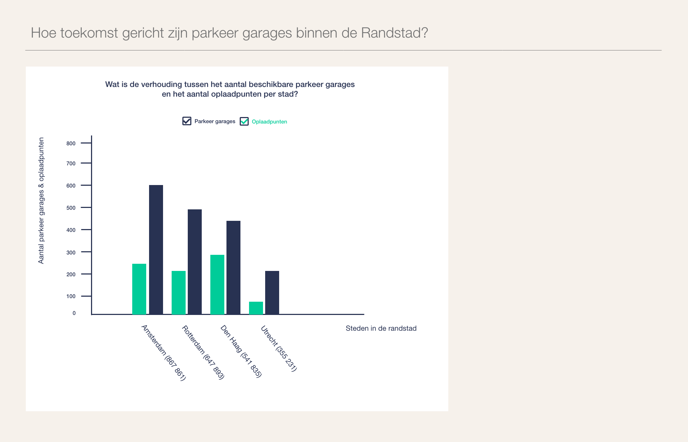
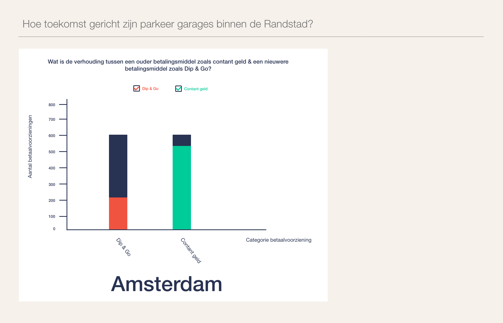

# Functional-programming

Dit is een repo voor het vak **Functional programming** `@cmd-information-design-20-21`.
Tijdens dit vak zullen onderwerpen als functional programming, het opschonen van data en het maken van data visualisaties
aan bod komen. Via de [Wiki](https://github.com/randy554/functional-programming/wiki/Debrief) zal ik mijn voortgang en bevindingen met de rest delen.

 ## Concept
 
 ### [Live demo](https://github.com/randy554/functional-programming/blob/main/index.html)
 
 Hoe toekomst gericht zijn parkeer garages binnen de Randstad?
 
 Met deze opdracht wil ik door middel van de RDW API, in kaart brengen hoeveel moderne parkeer garages er te zien zijn 
 in de **vier grootste** steden van de randstad. Hiervoor heb ik gegevens nodig van het CBS. De moderniteit van de 
 parkeer garages wordt aan de hand van de beschikbare betalingsmogelijkheid bepaald en of er een oplaadpunt aanwezig is.
 Deze gegevens moeten uit de dataset van het RDW worden gefilterd en worden opgeschoond voor gebruik. Het eindresultaat
 is een serie bar charts die de verhoudingen in kaart brengen tussen moderne en niet moderne parkeer garages.
 
 De huidige concept is een iteratie op een voorgaande [concept](http://example.com). 
  
  __Parkeer garages met/zonder oplaadpunten__
 
 
 __Parkeer garages met/zonder moderne betaalmogelijkheden__
 
 

 ## Inhoudsopgave

* [Intro](#functional-programming)
* [Live Demo](#concept)
* [Concept](#concept)
* [Features](#features)
* [Gebruikte data](#gebruikte-data)
* [Installeren](#installeren)
* [Credits](#credits)
* [Bronnen](#bronnen)

 
 ## Features
 
 * Bar chart met verhouding tussen aantal niet/wel moderne parkeer garages per stad (adhv oplaadpunten).
 * Bar chart met verhouding tussen aantal niet/wel moderne parkeer garages per stad (adhv betaalmogelijkheid).
 * Filter voor om de verhouding weergave te zien/ alleen moderne parkeer gegevens te zien. 
 * Tooltip bij hover chart
 
 ## Gebruikte data
 
 ### Enquete datavis
 
 Om de basis van functional programmeren onder de knie te krijgen en te oefenen met het opschonen van data, zal ik 
 gebruik maken van de datavis enquête dataset. Dit is een enquête die is afgenomen onder studenten van de opleiding
 CMD aan de HVA die de vakken datavisualisatie 1 & 2 hebben gevolgd.
 
 ### CBS
 
 Om in bezit te komen van de correcte cijfers over het aantal inwoners per stad, zal ik gebruik maken van de dataset 
 [regionale kerncijfers Nederland](https://opendata.cbs.nl/statline/?dl=2C8D4#/CBS/nl/dataset/70072ned/table?ts=1604532307222) van het CBS.
 
 ### RDW
 
 Voor de gegevens rondom het parkeren zal ik gebruik maken van verschillende datasets van het RDW. Zo gebruik ik voor 
 gegevens over de laadpunten [deze](https://opendata.rdw.nl/Parkeren/Open-Data-Parkeren-SPECIFICATIES-PARKEERGEBIED/b3us-f26s/data) dataset. 
 Om erachter te komen welke betaalmogelijkheden er per parkeer garage beschikbaar is, gebruik ik de 
 [betaalmethode gebied](https://opendata.rdw.nl/Parkeren/Open-Data-Parkeren-BETAALMETHODE-GEBIED/r3rs-ibz5).
 
## Installeren

```markdown
 
  #1. clone de repo
  https://github.com/randy554/functional-programming.git

  #2. Navigeer naar de root van de app
  open functional-programming

  #3. Bekijk site
  Open -> index.html 

  #4. Open browser console
  MAC OS X **Firefox** (Command + option + K)/Op webpagina -> Rechtermuisknop -> Inspect element -> Tab console  **Chrome** (Command + option + J)/ Op webpagina -> Rechtermuisknop -> Inspect -> Tab console

```

## Credits

* Laurens Arnoudse voor live coding demo's
* Jonah Meijers voor het omzetten van de dataset naar .JSON
* Robert Spier voor live demo JSON file import.

## Bronnen

* [freeCodeCamp](https://www.freecodecamp.org)
* [Fun fun functions](https://www.youtube.com/watch?v=BMUiFMZr7vk&list=PL0zVEGEvSaeEd9hlmCXrk5yUyqUag-n84&index=1)

## License

Creative Commons Attribution-ShareAlike 4.0 International <a href="License https://creativecommons.org/licenses/by-sa/4.0/" alt="Creative Commons Licens"> Link </a>